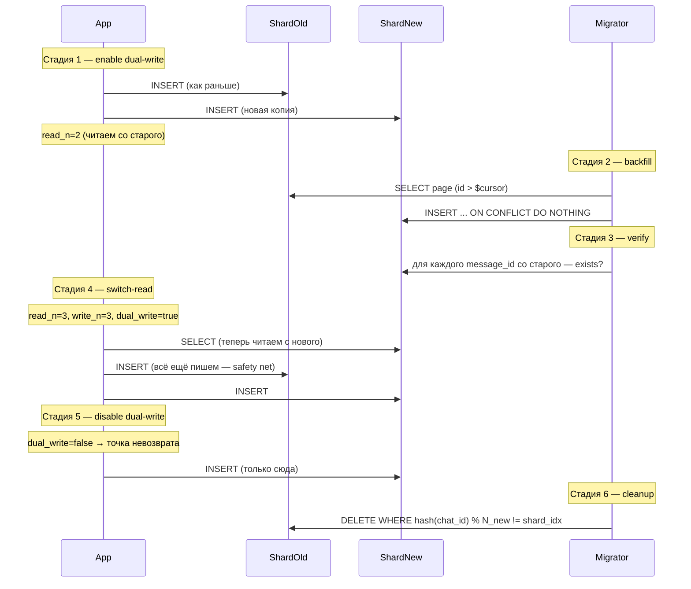

# Отчёт: ДЗ-5 — Шардирование подсистемы диалогов

**Дата:** 2026-05-05

---

## 1. Архитектурное решение

| Вопрос | Решение | Почему |
|---|---|---|
| Где хранить сообщения | Отдельный кластер из N PostgreSQL-инстансов | Отделить write-heavy профиль диалогов от существующего master/replica кластера ДЗ-3 |
| Ключ шардирования | `chat_id = SHA-256("v1\|" + min(u1,u2).bytes + "\|" + max(u1,u2).bytes)` | Симметричный (`chat_id(A,B)==chat_id(B,A)`) → вся переписка на одном шарде, `/list` ходит в один шард |
| Схема распределения | `hash(chat_id) % N` (через первые 8 байт SHA-256) | Прост, равномерен, проверим в учебном решардинге |
| Реализация | App-level sharding на N PG-инстансах | Цель курса — увидеть механику руками |
| Решардинг без даунтайма | Dual-write → backfill → verify → switch-read → cleanup | 6 этапов, каждый обратим до точки невозврата |
| Идемпотентность | `UNIQUE (message_id)` + `ON CONFLICT DO NOTHING` | Гарантирует, что параллельный backfill + live-трафик не порождают дублей |

---

## 2. Схема данных

```sql
CREATE TABLE messages (
    id           BIGSERIAL PRIMARY KEY,
    message_id   UUID        NOT NULL UNIQUE,   -- глобальный ID для идемпотентности
    chat_id      BYTEA       NOT NULL,           -- SHA-256, 32 байта
    sender_id    UUID        NOT NULL,
    recipient_id UUID        NOT NULL,
    body         TEXT        NOT NULL,
    created_at   TIMESTAMPTZ NOT NULL DEFAULT now()
);

CREATE INDEX idx_messages_chat_created
    ON messages (chat_id, created_at DESC, id DESC);
```

**Почему индекс именно такой:**

Запрос `/dialog/list`:
```sql
SELECT ... WHERE chat_id = $1 ORDER BY created_at DESC, id DESC LIMIT $2 OFFSET $3
```

Покрывается полностью: `chat_id` — фильтр равенства (ведущая колонка), `created_at DESC, id DESC` — порядок сортировки (DESC прописан в индексе → читаем в прямом направлении). PostgreSQL делает Index Scan без in-memory сортировки.

`id DESC` нужен как tie-breaker — два сообщения в одну миллисекунду перестают «дрейфовать» в выдаче.

---

## 3. Решардинг без даунтайма — алгоритм



### Инварианты, зашитые в код (`scripts/resharding.py`)

- `cmd_backfill` падает, если `dual_write=false` — иначе записи в окне терялись бы.
- `cmd_cleanup` падает, если `dual_write=true` — иначе удалили бы только что записанные строки.
- `cmd_verify` падает, если хоть одно сообщение не на новом шарде — `cmd_switch_read` тогда не выполнится по сценарию.

### Точка невозврата

| Стадия | Откат? | Цена ошибки |
|---|---|---|
| 1. dual-write | да | лишние записи на новом шарде |
| 2. backfill | да | лишние строки на новых шардах |
| 3. verify | — | только чтение |
| 4. switch-read | да | вернуть `read_n` |
| **5. disable dual-write** | **нет** | потеря данных |
| 6. cleanup | нет | удалили данные |

---

## 4. Эффект Леди Гаги

**Профиль:** один пользователь генерирует 50% всего write-трафика.

**Гипотеза:** при `chat_id`-шардировании это НЕ должно создавать hot shard, потому что Гага пишет МНОГИМ адресатам → её сообщения порождают МНОГО разных `chat_id` → они размазываются по шардам.

**Подтверждение** (см. секцию 5): даже с `LADY_GAGA_RATIO=0.5` распределение по шардам осталось 6829/6848 — перекос 0.14%.

**Когда это решение НЕ работает:** если горячим становится КОНКРЕТНЫЙ ЧАТ (один групповой стрим, конкурс с одной точкой записи). Тогда тысячи сообщений идут в один `chat_id` и попадают на один шард. Решения:

- Bucket по времени: `chat_id_for_routing = chat_id || floor(timestamp / 1h)` — `/list` становится scatter-gather, но шард не залипает.
- Перейти на directory-based sharding для горячих чатов: lookup-таблица `chat_id → shard_id`, точечно мигрировать чат на отдельный шард.

---

## 5. Нагрузочный тест

**Стенд:** macOS, Docker Desktop, 2 PostgreSQL-шарда + FastAPI app локально.
**Инструмент:** Locust 2.43, `scripts/locust/homework_5_locust.py`.

### Профиль 1: равномерный трафик (100 VU, 60 сек)

| Метрика | /send | /list |
|---|---|---|
| Запросов | 13667 | 5846 |
| RPS | 229 | 98 |
| p50 | 3 ms | 2 ms |
| p95 | 5 ms | 5 ms |
| p99 | 15 ms | 14 ms |
| Failures | 0 | 0 |

**Распределение по шардам после прогона:**
| shard0 | shard1 | перекос |
|---|---|---|
| 6854 | 6813 | 0.30% |

### Профиль 2: «Эффект Леди Гаги» (один VU генерирует 50% записей)

| Метрика | /send | /list |
|---|---|---|
| Запросов | 13677 | 5841 |
| p99 | 9 ms | 8 ms |
| Failures | 0 | 0 |

**Распределение по шардам:**
| shard0 | shard1 | перекос |
|---|---|---|
| 6829 | 6848 | 0.14% |

**Ключевой вывод:** распределение под Гагой осталось практически идеальным. `chat_id`-шардинг устойчив к hot writer'у. (Если бы шардили по `sender_id` — Гага залипла бы на одном шарде с 50% write-трафика на нём.)

---

## 6. Известные ограничения и что сделали бы иначе в продакшене

1. **`hash % N` фиксирует число шардов в коде.** При росте до десятков шардов имеет смысл перейти на consistent hashing (DynamoDB, Cassandra) — добавление шарда переносит только `1/N` данных вместо `(N-1)/N`.
2. **`BIGSERIAL` локален для шарда.** В продакшене лучше snowflake-ID `[shard_bits|timestamp|seq]` — даёт глобально уникальный, упорядоченный по времени ID без обращения к глобальному генератору.
3. **Pagination через `OFFSET` деградирует.** Для глубокой выдачи нужна keyset-пагинация: `WHERE created_at < $cursor_ts`. Это уже не «следующая страница на 100», а курсор.
4. **Шарды на одном диске (docker volumes)** — учебная установка. В проде шарды на разных физических дисках/нодах, иначе I/O общий.
5. **Dual-write не атомарен между шардами.** Если запись в old прошла, а в new — нет (краш приложения), будет рассинхронизация. В продакшене это лечится outbox pattern (запись в old + outbox одной транзакцией, отдельный воркер дописывает в new) либо двухфазной записью.
6. **Cleanup не тронут консистентно.** Между концом cleanup и моментом проверки могут возникать новые строки от запоздавших клиентов с устаревшим роутингом. В проде нужен grace period.

---

## 7. Запуск

```bash
# Поднять кластер (2 шарда диалогов)
docker compose up -d

# Тесты
.venv/bin/python -m pytest tests/

# Поднять 3-й шард для сценария решардинга
docker compose --profile resharding up -d dialogs-shard2

# Прогнать решардинг руками
.venv/bin/python -m scripts.resharding enable-dual-write --new-n 3
.venv/bin/python -m scripts.resharding backfill --new-n 3
.venv/bin/python -m scripts.resharding verify --new-n 3
.venv/bin/python -m scripts.resharding switch-read --new-n 3
.venv/bin/python -m scripts.resharding disable-dual-write
.venv/bin/python -m scripts.resharding cleanup --new-n 3

# Нагрузочный тест
.venv/bin/locust -f scripts/locust/homework_5_locust.py \
    --host http://127.0.0.1:8082 \
    --users 100 --spawn-rate 50 --run-time 60s --headless \
    --csv reports/hw5_uniform

LADY_GAGA_RATIO=0.5 .venv/bin/locust ... --csv reports/hw5_lady_gaga
```

---

## 8. Артефакты

| Файл                                        | Назначение |
|---------------------------------------------|---|
| `reports/homework_5_report.md`              | Этот отчёт |
| `migrations/dialogs/001_messages.sql`       | Схема таблицы `messages` |
| `app/dialogs/sharding.py`                   | `compute_chat_id`, `shard_for_chat` |
| `app/dialogs/cluster.py`                    | `DialogsCluster` — пулы, dual-write, reconfigure |
| `app/routes/dialogs.py`                     | `POST /send`, `GET /list` |
| `scripts/resharding.py`                     | CLI 6 стадий решардинга |
| `scripts/locust/homework_5_locust.py`       | Нагрузочный тест |
| `tests/unit/test_sharding.py`               | 11 unit-тестов pure-функций |
| `tests/integration/test_dialogs_cluster.py` | Распределение и локальность |
| `tests/integration/test_dialogs_send.py`    | `/send`: auth, 1 шард, валидация |
| `tests/integration/test_dialogs_list.py`    | `/list`: порядок, изоляция, пагинация |
| `tests/integration/test_resharding.py`      | Полный цикл 2→3 без потерь и дублей |
